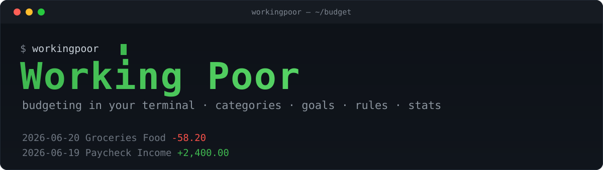

<div align="center">



# Gröschön

**A keyboard-driven budgeting application that lives in your terminal.**

[](https://www.rust-lang.org/)
[](https://ratatui.rs/)
[](https://doc.rust-lang.org/edition-guide/)

</div>

---

Gröschön — named for the humble *Groschen*, the coin you actually count — is a
personal-finance companion for people who would rather stay on the command line
than open another web dashboard. It reads your accounts and transactions,
organises them into **categories**, tracks progress toward **goals**, applies
**rules** to keep your ledger tidy, and surfaces **statistics** so you always
know where the money went — all without leaving the terminal.

## Features

- **Accounts & transactions** — Load your accounts and browse every transaction
  in a fast, navigable table with running balances.
- **Categories** — Group spending and income so your budget reflects how you
  actually live.
- **Goals** — Set targets (saving up, paying down, staying under) and watch your
  progress.
- **Rules** — Automatically categorise and annotate transactions as they come in.
- **Statistics** — Summaries and reports that turn raw transactions into
  insight.
- **CSV import** — Bring in history from existing tools via the
  [Actual](https://actualbudget.org/) export format.

> **Status:** Gröschön is in early development. Account browsing, the
> transaction table, balances, and Actual CSV import are in place today;
> categories, goals, rules, and statistics are actively being built out.

## Getting started

You'll need a recent [Rust toolchain](https://rustup.rs/) (Rust 2024 edition).

```sh
# Clone the repository
git clone https://github.com/Dalhai/WorkingPoor.git
cd WorkingPoor

# Build and run
cargo run
```

### Key bindings

| Key            | Action                          |
| -------------- | ------------------------------- |
| `↑` / `↓`      | Move the transaction selection  |
| `q` / `Esc`    | Quit                            |

## Importing data

Gröschön currently reads exports in the
[Actual](https://actualbudget.org/) CSV format. During development it loads a
sample export from `dev/sample_transactions_actual.csv`; the importer maps the
CSV columns onto the internal finance model and keeps the two decoupled so the
export format can change without touching the domain types.

## Built with

- [ratatui](https://ratatui.rs/) — terminal user interface
- [tachyonfx](https://github.com/junkdog/tachyonfx) — shader-like effects for ratatui
- [chrono](https://github.com/chronotope/chrono) — dates and times
- [serde](https://serde.rs/) + [csv](https://github.com/BurntSushi/rust-csv) — import & deserialization
- [anyhow](https://github.com/dtolnay/anyhow) + [thiserror](https://github.com/dtolnay/thiserror) — error handling

## Development

```sh
cargo build      # compile
cargo test       # run the test suite
cargo run        # launch the app
```

Contributions follow [Conventional Commits](https://www.conventionalcommits.org/).

## License

Gröschön is licensed under the GNU Lesser General Public License, version 3 or
later (LGPL-3.0-or-later). See [`COPYING.LESSER`](COPYING.LESSER) for the LGPL
terms and [`COPYING`](COPYING) for the GPL terms it builds upon.
